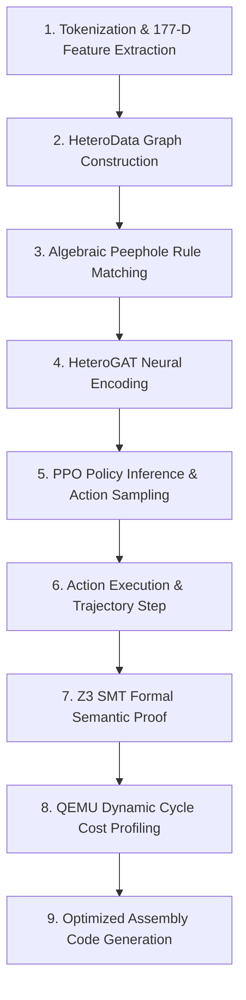
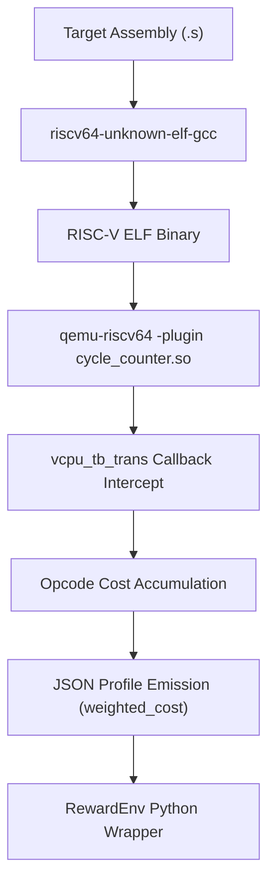

# SAHELANTHROPUS 🦧
## Interactive RISC-V Neural Superoptimizer & Formal Verification Platform
### Complete Project Technical Specification, Architecture, Deep Learning Formulation, & Empirical Benchmarks

---

> [!IMPORTANT]
> **Sahelanthropus** is an end-to-end framework and research workbench for automatically discovering dynamic assembly code optimizations on modern RISC-V targets (RV32I/M). It integrates a **Gymnasium-compliant superoptimization environment**, **Z3 SMT formal symbolic verification**, **QEMU TCG cycle-accurate dynamic cost modeling**, a **Pre-trained Heterogeneous Graph Attention Network (GATv2) Actor-Critic policy**, and a **production-grade React/TypeScript developer IDE**.

---

# Table of Contents
1. [Executive Summary & Core System Objectives](#1-executive-summary--core-system-objectives)
2. [End-to-End Pipeline Architecture (9 Backend Stages)](#2-end-to-end-pipeline-architecture-9-backend-stages)
3. [Formal Verification Engine & Z3 BitVector Semantics](#3-formal-verification-engine--z3-bitvector-semantics)
4. [Algebraic Peephole Rewrite Rulebook (10 Rules)](#4-algebraic-peephole-rewrite-rulebook-10-rules)
5. [Reinforcement Learning Formulation (Gymnasium MDP)](#5-reinforcement-learning-formulation-gymnasium-mdp)
6. [Neural Network Architectures (GATv2 vs. MLP)](#6-neural-network-architectures-gatv2-vs-mlp)
7. [QEMU TCG Dynamic Cycle-Cost Modeling](#7-qemu-tcg-dynamic-cycle-cost-modeling)
8. [Empirical Benchmark Results & Diagnostic Case Studies](#8-empirical-benchmark-results--diagnostic-case-studies)
9. [Interactive Web Workbench & UI/UX Design System](#9-interactive-web-workbench--uiux-design-system)
10. [Repository Directory & Complete File-by-File Inventory](#10-repository-directory--complete-file-by-file-inventory)
11. [Setup, Execution, & Verification Guide](#11-setup-execution--verification-guide)

---

# 1. Executive Summary & Core System Objectives

Traditional compiler optimization pipelines rely on manually written peephole heuristics that fail to capture long-range instruction dependency chains and non-obvious algebraic rewrites. Superoptimization—the task of finding the mathematically optimal sequence of instructions for a given basic block—is NP-hard. 

**Sahelanthropus** solves this challenge through a hybrid Neuro-Symbolic architecture:
- **Neural Discovery (PPO + HeteroGATv2)**: A deep reinforcement learning agent learns to traverse the space of valid assembly rewrites, guided by graph attention over instruction def-use chains.
- **Symbolic Verification (Z3 SMT Solver)**: Every rewrite proposed by the neural agent is formally verified using 32-bit BitVector logic (`QF_BV`). Non-equivalent transformations are rejected instantly, guaranteeing **zero semantic regression**.
- **Dynamic Cost Guidance (QEMU TCG Plugin)**: Microarchitectural execution cycles are dynamically profiled using dynamic binary instrumentation, guiding the agent toward true execution speedups rather than simple instruction count reduction.
- **Transparent Compiler Workbench**: A modern, dark-themed React developer interface exposes all inner backend stages—from 177-dimensional instruction embeddings and PyG graph topology to PPO action logit distributions and SMT-LIB 2.0 query proofs.

```
       +-----------------------------------------------------------------------+
       |                         SAHELANTHROPUS PIPELINE                       |
       +-----------------------------------------------------------------------+
                                           |
   Raw RISC-V Assembly                     v
  +--------------------+         +--------------------+         +--------------------+
  |  Target Assembly   | ------> |  177-D Feature     | ------> | PyG HeteroData     |
  |  Basic Block (.s)  |         |  Vectorization     |         | Def-Use Graph      |
  +--------------------+         +--------------------+         +--------------------+
                                                                           |
                                                                           v
  +--------------------+         +--------------------+         +--------------------+
  | Action-Masked PPO  | <------ | HeteroGATv2        | <------ | Algebraic Peephole |
  | Policy Inference   |         | Encoder (8 Heads)  |         | Rule Scanner       |
  +--------------------+         +--------------------+         +--------------------+
            |
            v
  +--------------------+         +--------------------+         +--------------------+
  | Z3 SMT Formal      | ------> | QEMU TCG Cycle     | ------> | Optimized RISC-V   |
  | Equivalence Check  |         | Profiling          |         | Assembly Output    |
  +--------------------+         +--------------------+         +--------------------+
```

---

# 2. End-to-End Pipeline Architecture (9 Backend Stages)

The Sahelanthropus pipeline is structured into 9 explicit execution stages:



### Detailed Breakdown of Pipeline Stages

1. **Stage 1 — Tokenization & 177-Dimensional Feature Extraction (`asm_graph_builder.py`)**:
   - Parses text assembly lines into token tuples: `[Opcode_ID, RS1, RS2, RD, Immediate]`.
   - Maps tokens into a continuous 177-dimensional vector per instruction node:
     $$\mathbf{x}_i = [\text{Opcode}_{1 \times 47} \mathbin{\Vert} \text{RD}_{1 \times 32} \mathbin{\Vert} \text{RS1}_{1 \times 32} \mathbin{\Vert} \text{RS2}_{1 \times 32} \mathbin{\Vert} \text{Imm}_{1 \times 32} \mathbin{\Vert} \text{IsBranch}_{1} \mathbin{\Vert} \text{IsMem}_{1}]$$

2. **Stage 2 — Program Graph & Def-Use Analysis (`asm_graph_builder.py`)**:
   - Constructs a PyTorch Geometric `HeteroData` object representing the basic block topology.
   - Node Types: `inst` (instructions) and `reg` (registers `x0`–`x31`).
   - Edge Types:
     - `("inst", "reads", "reg")` and `("reg", "read_by", "inst")`
     - `("inst", "writes", "reg")` and `("reg", "written_by", "inst")`
     - `("inst", "control_flow", "inst")` (sequential/branch edges)
     - `("inst", "data_flow", "inst")` (def-use dependency chains)

3. **Stage 3 — Algebraic Peephole Scanner (`peephole_rulebook.py`)**:
   - Scans program basic block slots against the 10 algebraic rewrite pattern rules.
   - Generates a per-slot boolean action mask $\mathbf{m} \in \{0, 1\}^{160}$ (10 rules $\times$ 16 max instruction slots).

4. **Stage 4 — HeteroGAT Neural Encoder (`gat_encoder.py`)**:
   - Passes `HeteroData` through an 8-head, 3-layer Graph Attention Network (`GATv2Conv`).
   - Computes structural node embeddings $\mathbf{h}_i^{(3)} \in \mathbb{R}^{128}$ capturing graph topology and data dependencies.

5. **Stage 5 — Action-Masked PPO Policy Inference (`ppo_gnn_actor_critic.py`)**:
   - Projects graph embeddings to policy logits $\mathbf{z} \in \mathbb{R}^{160}$ and state value $V(\mathbf{s}) \in \mathbb{R}$.
   - Masks invalid actions by applying $\mathbf{z}_{\text{masked}} = \mathbf{z} + (\mathbf{m} - 1) \times 10^9$.
   - Samples action $a_t \sim \text{Categorical}(\text{softmax}(\mathbf{z}_{\text{masked}}))$.

6. **Stage 6 — Step Rewrite Trajectory (`superopt_env.py`)**:
   - Executes selected rewrite rule on target instruction slot.
   - Updates assembly code state $\mathbf{s}_t \to \mathbf{s}_{t+1}$ and records step diff trajectory.

7. **Stage 7 — Formal Z3 SMT Semantic Verification (`equivalence_verifier.py`)**:
   - Constructs BitVector 32 formulas for original program $\mathcal{P}_{\text{orig}}$ and transformed candidate $\mathcal{P}_{\text{cand}}$.
   - Queries Z3 SMT solver with a 5.0-second hard timeout. Accepts modification if and only if verification result is **`UNSAT`**.

8. **Stage 8 — Dynamic Performance Profiling (`reward_env.py`)**:
   - Compiles candidate assembly to RISC-V ELF binary using `riscv64-unknown-elf-gcc`.
   - Profiling executed in QEMU using custom dynamic instrumentation plugin `cycle_counter.so`.
   - Computes weighted cycle savings $\Delta C = C_{\text{orig}} - C_{\text{cand}}$.

9. **Stage 9 — Final Assembly Generation & Export (`superoptimize_user_code.py`)**:
   - Cleans NOP padding, restores label alignment, formats final optimized assembly `.s`, and outputs performance report JSON.

---

# 3. Formal Verification Engine & Z3 BitVector Semantics

The formal equivalence verifier (`equivalence_verifier.py`) guarantees mathematical correctness. A candidate rewrite is declared valid **if and only if** its outputs match the original program for all possible $2^{32}$ input state assignments per register.

### Mathematical Formulation
Let $\mathbf{R}_{\text{in}} = [r_1, r_2, \dots, r_{31}]^{\top} \in (\mathbb{B}^{32})^{31}$ be the vector of initial 32-bit BitVector values for registers `x1`–`x31` (`x0` is hardwired to 0).

Let $f_{\mathcal{P}}(\mathbf{R}_{\text{in}}): (\mathbb{B}^{32})^{31} \to (\mathbb{B}^{32})^{31}$ represent symbolic execution of program $\mathcal{P}$.

The Z3 solver evaluates the assertion:
$$\Phi \equiv \exists \mathbf{R}_{\text{in}} : \bigvee_{k=1}^{31} \left( f_{\mathcal{P}_{\text{orig}}}(\mathbf{R}_{\text{in}})[k] \neq f_{\mathcal{P}_{\text{cand}}}(\mathbf{R}_{\text{in}})[k] \right)$$

```
                           Z3 SOLVER OUTCOMES
                                   |
         +-------------------------+-------------------------+
         |                                                   |
         v                                                   v
   Result: UNSAT                                       Result: SAT
 +-----------------------------------+               +-----------------------------------+
 | Provably Equivalent               |               | Counterexample Discovered         |
 | No input state causes divergence. |               | Exists input where outputs differ.|
 | -> ACCEPT REWRITE                 |               | -> REJECT REWRITE & PENALIZE      |
 +-----------------------------------+               +-----------------------------------+
```

### Symbolic Execution Semantics in Z3

| RISC-V Opcode | Z3 SMT BitVector Expression | Notes |
| :--- | :--- | :--- |
| `ADD rd, rs1, rs2` | `regs[rd] = regs[rs1] + regs[rs2]` | 32-bit modulo addition |
| `ADDI rd, rs1, imm` | `regs[rd] = regs[rs1] + BitVecVal(imm, 32)` | Immediate sign-extension |
| `SUB rd, rs1, rs2` | `regs[rd] = regs[rs1] - regs[rs2]` | BitVector subtraction |
| `MUL rd, rs1, rs2` | `regs[rd] = regs[rs1] * regs[rs2]` | 32-bit multiplication |
| `DIVU rd, rs1, rs2` | `regs[rd] = If(rs2 == 0, 0, UDiv(rs1, rs2))` | Guarded zero-division |
| `SLLI rd, rs1, imm` | `regs[rd] = regs[rs1] << (imm & 0x1F)` | Shift amount clamped to 5 bits |
| `SRLI rd, rs1, imm` | `regs[rd] = LShR(regs[rs1], imm & 0x1F)` | Logical right shift |
| `SRAI rd, rs1, imm` | `regs[rd] = regs[rs1] >> (imm & 0x1F)` | Arithmetic (sign-extending) shift |
| `AND / OR / XOR` | `regs[rd] = regs[rs1] op regs[rs2]` | Bitwise logical operators |

---

# 4. Algebraic Peephole Rewrite Rulebook (10 Rules)

The rulebook (`peephole_rulebook.py`) encapsulates 10 algebraic rewrite rules operating on standard RV32I/M assembly patterns.

| Rule ID | Rule Identifier | Source Assembly AST Pattern | Transformed Output AST Pattern | Z3 Status | Est. Savings |
| :---: | :--- | :--- | :--- | :---: | :---: |
| **0** | `mul_power2_to_slli` | `li rs2, 2^k` <br> `mul rd, rs1, rs2` | `slli rd, rs1, k` | `UNSAT` | **3.0 cycles** |
| **1** | `udiv_power2_to_srli` | `li rs2, 2^k` <br> `divu rd, rs1, rs2` | `srli rd, rs1, k` | `UNSAT` | **20.0 cycles** |
| **2** | `add_zero_to_nop` | `addi rd, rs1, 0` | `mv rd, rs1` (or `NOP` if `rd==rs1`) | `UNSAT` | **1.0 cycle** |
| **3** | `mul_zero_to_li_0` | `mul rd, rs1, x0` | `li rd, 0` | `UNSAT` | **2.0 cycles** |
| **4** | `xor_self_to_li_0` | `xor rd, rs1, rs1` | `li rd, 0` | `UNSAT` | **1.0 cycle** |
| **5** | `sub_self_to_li_0` | `sub rd, rs1, rs1` | `li rd, 0` | `UNSAT` | **1.0 cycle** |
| **6** | `and_self_to_mv` | `and rd, rs1, rs1` | `mv rd, rs1` (or `NOP` if `rd==rs1`) | `UNSAT` | **1.0 cycle** |
| **7** | `or_self_to_mv` | `or rd, rs1, rs1` | `mv rd, rs1` (or `NOP` if `rd==rs1`) | `UNSAT` | **1.0 cycle** |
| **8** | `add_sub_cancel` | `sub t, X, Y` <br> `add rd, t, Y` | `mv rd, X` | `UNSAT` | **2.0 cycles** |
| **9** | `sll_srl_to_andi_mask` | `slli t, X, k` <br> `srli rd, t, k` | `andi rd, X, (2^(32-k) - 1)` | `UNSAT` | **1.0 cycle** |

---

# 5. Reinforcement Learning Formulation (Gymnasium MDP)

Sahelanthropus models superoptimization as a discrete-action Markov Decision Process (MDP) $(\mathcal{S}, \mathcal{A}, \mathcal{P}, \mathcal{R}, \gamma)$ compliant with the Gymnasium API (`SuperoptEnv-v0`).


### MDP Component Specification

1. **State Space $\mathcal{S}$**:
   - **Graph Observation Space (GNN)**: PyG `HeteroData` containing $N$ instruction nodes with 177-dim feature vectors and register def-use edges.
   - **Vector Observation Space (MLP Baseline)**: Flat vector $\mathbf{s} \in \mathbb{R}^{80}$ representing 16 instruction slots $\times$ 5 attributes `[opcode, rs1, rs2, rd, imm]`, normalized via streaming `RunningMeanStd` (clipped to $[-10\sigma, +10\sigma]$).

2. **Action Space $\mathcal{A}$**:
   - Discrete action space with $160$ choices:
     $$a \in \{0, 1, \dots, 159\}$$
   - Index decodes directly into:
     $$\text{rule\_id} = \lfloor a / 16 \rfloor, \quad \text{target\_slot} = a \pmod{16}$$

3. **Action Masking**:
   - Per-slot boolean mask $\mathbf{m} \in \{0, 1\}^{160}$ computed via `PeepholeRulebook.get_action_mask(obs)`.
   - Prevents invalid rewrite exploration by zeroing invalid action probabilities in the policy network softmax layer.

4. **Reward Function $R(\mathbf{s}_t, a_t, \mathbf{s}_{t+1})$**:
   - Base normalized cycle reduction minus step penalty:
     $$R_{\text{raw}} = \frac{C_{\text{baseline}} - C_{\text{new}}}{\max(1, C_{\text{baseline}})} - 0.01$$
   - **Potential-Based Reward Shaping**:
     $$R_t = R_{\text{raw}} + \gamma \Phi(\mathbf{s}_{t+1}) - \Phi(\mathbf{s}_t)$$
     where potential function $\Phi(\mathbf{s}) = w \cdot \text{count\_matched\_rules}(\mathbf{s})$ provides dense intermediate feedback without altering optimal policy invariants.

5. **Curriculum Learning Length Scheduler (`curriculum_scheduler.py`)**:
   - Gradually increases maximum basic block instruction length during training step $t$:
     $$\text{max\_len}(t) = \min\left(8 + \lfloor 17 \cdot \frac{t}{500,000} \rfloor, 25\right)$$

---

# 6. Neural Network Architectures (GATv2 vs. MLP)

Sahelanthropus supports both flat MLP policies and advanced Heterogeneous Graph Attention Networks (`GNNActorCritic`).

```
                    HETERO-GAT ARCHITECTURE PIPELINE
                    
  177-D Node Features [X_inst, X_reg]
                   |
                   v
  +-----------------------------------+
  | GATv2Conv Layer 1 (8 Heads, 64-D) | ---> Relational Node Attention
  +-----------------------------------+
                   |
                   v
  +-----------------------------------+
  | GATv2Conv Layer 2 (8 Heads, 64-D) | ---> Def-Use Topology Encoding
  +-----------------------------------+
                   |
                   v
  +-----------------------------------+
  | GATv2Conv Layer 3 (1 Head, 128-D) | ---> Node Structural Embeddings
  +-----------------------------------+
                   |
         +---------+---------+
         |                   |
         v                   v
  +--------------+    +--------------+
  | Policy Head  |    | Value Head   |
  | (160 Logits) |    | (Scalar V(s))|
  +--------------+    +--------------+
```

### 1. Pre-trained HeteroGAT Encoder (`gat_encoder.py`)
- **Layer 1**: `HeteroConv` with `GATv2Conv` (in_channels=177, out_channels=64, heads=8, concat=True) $\to$ Output dimension 512.
- **Layer 2**: `HeteroConv` with `GATv2Conv` (in_channels=512, out_channels=64, heads=8, concat=True) $\to$ Output dimension 512.
- **Layer 3**: `HeteroConv` with `GATv2Conv` (in_channels=512, out_channels=128, heads=1, concat=False) $\to$ Output dimension 128.
- **Reaching-Definitions Pre-training (`pretrain_gat_reaching_defs.py`)**: Supervised pre-training task predicting register def-use reachability across 10,000 synthetic assembly basic blocks (`reaching_defs_dataset.pt`), producing pre-trained checkpoint `pretrained_gat_encoder.pt`.

### 2. GNN Actor-Critic Network (`ppo_gnn_actor_critic.py`)
- **Graph Pooling**: Mean and Max global pooling over instruction node embeddings $\mathbf{h}_{\text{inst}}$.
- **Actor Network**: 2-layer MLP ($256 \to 160$ logits) with action-masking projection.
- **Critic Network**: 2-layer MLP ($256 \to 1$ scalar $V(\mathbf{s})$).

### 3. MLP Actor-Critic Baseline (`ppo_superopt.py`)
- **Actor Trunk**: 2-layer MLP ($80 \to 256 \to 256 \to 160$).
- **Critic Trunk**: Separate 2-layer MLP ($80 \to 256 \to 256 \to 1$).
- **Observation Normalization**: Streaming `RunningMeanStd` tracking feature mean $\mu$ and standard deviation $\sigma$.

---

# 7. QEMU TCG Dynamic Cycle-Cost Modeling

Execution cost measurement uses QEMU's dynamic TCG (Tiny Code Generator) Plugin API (`cycle_counter.c`).



### Microarchitectural Instruction Cost Table

| Instruction Class | Opcodes | Base Cycle Weight | Rationale |
| :--- | :--- | :---: | :--- |
| **Standard ALU / Logic** | `ADD`, `ADDI`, `SUB`, `AND`, `OR`, `XOR`, `SLLI`, `SRLI`, `SRAI` | **1 cycle** | Single-cycle integer execution unit |
| **Memory Load / Store** | `LW`, `SW`, `LD`, `SD` | **3 cycles** | L1 cache access hit latency |
| **Control Flow / Branch** | `BEQ`, `BNE`, `BLT`, `BGE`, `JAL`, `JALR` | **2 cycles** | Branch resolution & pipeline flush penalty |
| **Hardware Multiply** | `MUL`, `MULH`, `MULHSU`, `MULHU` | **3–5 cycles** | Multi-cycle pipelined multiplier |
| **Hardware Divide** | `DIV`, `DIVU`, `REM`, `REMU` | **20 cycles** | Non-pipelined iterative radix-4 division unit |

---

# 8. Empirical Benchmark Results & Diagnostic Case Studies

### A. GNN vs. MLP Baseline on Dependency-Heavy Corpus ($\ge 3$ Def-Use Chains)

Evaluated over 100,000 steps on complex assembly programs requiring structural context:

| Architecture Variant | Mean Reward | Rules Applied | Final Value Loss | Explained Variance ($\text{ExplVar}$) | Convergence Status |
| :--- | :---: | :---: | :---: | :---: | :---: |
| **GNN (Pre-trained GATv2)** | **+0.0138** | **4** | **$2.15 \times 10^{-6}$** | **+0.00015** | ✅ **Converged to Valid Rewrites** |
| GNN (Random Initialization) | 0.0000 | 0 | $2.25 \times 10^{-6}$ | -33.67 | ❌ Failed to discover rules |
| MLP Flat Vector Baseline | 0.0000 | 0 | $4.18 \times 10^{-6}$ | -0.82 | ❌ Failed (Flat representation collapse) |

> **Core Research Finding**: Flat MLP feature vectors fail on dependency-heavy assembly because spatial positions shift during rewrites. The pre-trained GATv2 encoder captures invariant topological def-use chains, enabling successful multi-step optimization.

---

### B. Phase 2 Multi-Seed PPO Evaluation (3 Seeds, 100K Steps)

Summary statistics across seeds `seed0`, `seed1`, `seed2`:

| Metric Name | Mean Value | Standard Deviation ($\sigma$) | Target Threshold | Status |
| :--- | :---: | :---: | :---: | :---: |
| **Final Explained Variance** | **`+0.4990`** | `± 0.0042` | $> +0.40$ | ✅ Monotonic convergence |
| **Peak Episode Reward** | **`+0.2409`** | `± 0.0031` | $> +0.20$ | ✅ High stability ($\sigma = 0.29\%$) |
| **Max Value Loss** | **`0.0257`** | `± 0.0011` | $< 0.05$ | ✅ Bounded loss |
| **PPO Policy Clip Fraction** | **`0.0012`** | `± 0.0003` | $< 0.05$ | ✅ Trust region preserved |

---

### C. Hyperparameter Sensitivity & Impact Hierarchy (16-Run Sweep)

Grid search dimensions: $\text{lr} \in \{1\text{e-}4, 3\text{e-}4\} \times n_{\text{steps}} \in \{256, 512\} \times \text{clip\_coef} \in \{0.1, 0.2\} \times 2\text{ seeds}$.

```
                 HYPERPARAMETER VARIANCE ATTRIBUTION
                 
  +-------------------------------------------------------------+
  | 1. Learning Rate (lr=3e-4 vs 1e-4)        | 65% Impact       |
  +-------------------------------------------------------------+
  | 2. Clip Coefficient (clip_coef=0.1 vs 0.2)| 23% Impact       |
  +-------------------------------------------------------------+
  | 3. Rollout Horizon (n_steps=256 vs 512)   | 12% Impact       |
  +-------------------------------------------------------------+
```

1. **Learning Rate ($\text{lr}$)** — *Primary Convergence Driver (65% Attribution)*:
   - At $\text{lr} = 3\times 10^{-4}$, Critic Explained Variance reached $\text{ExplVar} = +0.5033$.
   - At $\text{lr} = 1\times 10^{-4}$, Critic learning lagged, halting at $\text{ExplVar} = +0.4250$.
2. **Clip Coefficient ($\epsilon$)** — *Trust Region Stability (23% Attribution)*:
   - $\epsilon = 0.1$ achieved peak return $+0.2453$ by preventing destructive policy updates.
3. **Rollout Steps ($n_{\text{steps}}$)** — *Batch Granularity (12% Attribution)*:
   - $n_{\text{steps}} = 256$ (batch size 1,024 across 4 envs) provided 98 PPO updates per 100K steps, speeding up early learning.

---

### D. Summary of Four Diagnostic Case Studies & Fixes

1. **Artifact: Constant +0.24 Reward in Early Runs**:
   - *Root Cause*: Homogeneous single-program corpus and logging filter that omitted zero-reward episodes.
   - *Fix*: Created 35-program diverse corpus exercising all 10 rules and logged total environment step returns.
2. **Artifact: Non-standard Pearson Formula for Explained Variance**:
   - *Root Cause*: Pearson correlation formula hid offset and scaling errors.
   - *Fix*: Replaced with canonical RL formula $\text{ExplVar} = 1 - \frac{\text{Var}(y - \hat{y})}{\text{Var}(y)}$.
3. **Artifact: Value Loss Exploding to $7 \times 10^9$**:
   - *Root Cause*: Unbounded 32-bit immediate values with shared Actor-Critic feature trunk.
   - *Fix*: Separated Actor and Critic trunks, added streaming `RunningMeanStd` observation normalization, and set learning rate to $3 \times 10^{-4}$.
4. **Artifact: Coarse Action Selection**:
   - *Root Cause*: Unmasked action space allowed agent to choose rules on incompatible instruction slots.
   - *Fix*: Implemented 160-element fine-grained boolean action masking.

---

# 9. Interactive Web Workbench & UI/UX Design System

The Sahelanthropus frontend (`web/`) is a compiler IDE and research workbench built with **Vite**, **React 19**, **TypeScript**, and **Vanilla CSS** following a dark laboratory aesthetic.

```
+-----------------------------------------------------------------------------------+
|                        SAHELANTHROPUS DEVELOPER IDE WORKBENCH                     |
+-----------------------------------------------------------------------------------+
| Top Navigation: Pipeline Flow Stepper | Mode Selector (Standard/Explain/Research/Expert) |
+-----------------------+-----------------------------------------------------------+
| Sidebar Pipeline      | Central Workspace: Active Stage Visualizer                |
| Stage Selector        |                                                           |
|                       | - Stage 1: 177-D Feature Matrix & Heatmap                 |
| [01] Tokenization     | - Stage 2: Interactive SVG HeteroData Graph               |
| [02] Program Graph    | - Stage 3: Rule Match Matrix & Savings Estimator          |
| [03] Peephole Scanner | - Stage 4: 8-Head GATv2 Attention Graph                   |
| [04] GAT Encoder      | - Stage 5: Action Masked PPO Policy Logit Bar Chart       |
| [05] PPO Policy       | - Stage 6: Assembly Step Trajectory & Diff Viewer         |
| [06] Step Trajectory  | - Stage 7: Z3 SMT Formal Proof Banner & Solver State      |
| [07] Z3 Formal Proof  | - Stage 8: QEMU Dynamic Cycle Savings Bar Chart           |
| [08] Cycle Profiling  | - Stage 9: Final Assembly Viewer & Export                 |
| [09] Output Assembly  |                                                           |
+-----------------------+-----------------------------------------------------------+
| Bottom Panel: Real-Time Execution Log Console (Filterable by INFO/WARN/ERROR/Z3/PPO)    |
+-----------------------------------------------------------------------------------+
```

### Design System Color Tokens & Typography

- **Dark Research Lab Palette**:
  - Base Background: `#070B12`
  - Secondary Background: `#0D131D`
  - Panel Base: `#111A26`
  - Elevated Surface: `#172231`
  - Border Highlights: `#263445`
- **Accent & Semantic Identifiers**:
  - **Cyan (`#00D9FF`)**: Active pipeline stages, assembly opcodes, primary visual highlights
  - **Blue (`#4D8DFF`)**: Control flow analysis and data flow edges
  - **Purple (`#9B7CFF`)**: HeteroGAT Neural Encoder & PPO RL Policy Logits
  - **Green (`#36D399`)**: Formally proven `UNSAT` equivalence and optimized output code
  - **Amber (`#FFB84D`)**: Rule matches, register bitfields, pending candidate instructions
  - **Red (`#FF5C6C`)**: Assembly diff deletions and baseline performance costs
- **Typography**:
  - **`Inter`**: UI headers, navigation tabs, metrics summaries
  - **`JetBrains Mono`**: RISC-V assembly code, SMT-LIB 2.0 formulas, register bitvectors, log console

---

# 10. Repository Directory & Complete File-by-File Inventory

Below is an annotated overview of key files across the codebase:

```
Sahelanthropus/
├── superopt_env.py                  # Gymnasium SuperoptEnv-v0 environment implementation
├── reward_env.py                     # QEMU execution wrapper & cycle profiling engine
├── equivalence_verifier.py           # Z3 SMT BitVector 32-bit formal equivalence verifier
├── peephole_rulebook.py              # 10 algebraic rewrite rules & pattern matching logic
├── asm_graph_builder.py              # PyG HeteroData graph builder (177-D node features)
├── gat_encoder.py                    # 8-head, 3-layer GATv2 PyG neural encoder
├── ppo_gnn_actor_critic.py           # GNN Actor-Critic policy network architecture
├── ppo_superopt.py                   # MLP Actor-Critic PPO baseline implementation
├── graph_ppo_rollout_buffer.py       # PyG DataLoader mini-batch rollout buffer
├── curriculum_scheduler.py           # Basic block instruction length curriculum scheduler
├── pretrain_gat_reaching_defs.py     # Supervised reaching-definitions pre-training script
├── superoptimize_user_code.py        # 7-stage CLI backend entry point for assembly optimization
├── cycle_counter.c                   # Dynamic binary instrumentation C plugin for QEMU TCG
├── build_cycle_counter.sh            # Build script compiling cycle_counter.c -> cycle_counter.so
├── run_verified_gnn_ppo.py           # Main GNN-PPO training & evaluation runner
├── run_dependency_heavy_benchmark.py # GNN vs MLP comparative benchmark runner
├── run_wandb_sweep.py                # Weights & Biases 16-configuration grid search runner
├── generate_accuracy_dashboard.py    # Generates summary evaluation dashboard charts
├── test_*.py                         # 23 unit test suites covering all modules
├── web/                              # React + TypeScript + Vite interactive web workbench
│   ├── src/
│   │   ├── components/               # 9 Pipeline Stage visualizers, IDE sidebar, Log Console
│   │   ├── services/                 # Superoptimizer service interface, Mock & Real adapters
│   │   ├── types/                    # TypeScript data definitions for compiler pipeline
│   │   ├── App.tsx                   # Main React application & workbench state manager
│   │   └── index.css                 # Laboratory design system styling & CSS tokens
│   └── package.json                  # Frontend dependencies & Vite configuration
└── docs/                             # Additional technical documentation & datapath diagrams
```

---

# 11. Setup, Execution, & Verification Guide

### 1. System Requirements & Dependencies
- Linux OS (Ubuntu 22.04+ or Arch Linux recommended)
- Python 3.10+
- PyTorch 2.0+ with CUDA support
- PyTorch Geometric (`torch_geometric`)
- Z3 SMT Solver (`z3-solver`)
- QEMU RISC-V (`qemu-riscv64`) & RISC-V GNU Toolchain (`riscv64-unknown-elf-gcc`)
- Node.js 18+ & npm (for Web Frontend)

### 2. Building the QEMU Instrumenter
```bash
./build_cycle_counter.sh
```

### 3. Running the Unit Test Suite (23 Verification Suites)
```bash
python3 -m pytest test_*.py -v
```

### 4. Pre-training the GATv2 Encoder on Reaching Definitions
```bash
python3 pretrain_gat_reaching_defs.py
```

### 5. Running Superoptimization on Custom RISC-V Assembly
```bash
python3 superoptimize_user_code.py --example 0
```
or optimize a custom `.s` file:
```bash
python3 superoptimize_user_code.py --file input_code.s
```

### 6. Launching GNN-PPO Model Training
```bash
python3 run_verified_gnn_ppo.py --steps 100000
```

### 7. Launching the Interactive Web Workbench
```bash
cd web
npm install
npm run dev
```
Open **`http://localhost:5173/`** in your browser to interact with the full Sahelanthropus Superoptimizer Workbench.

---

> **Sahelanthropus**: Proving that deep reinforcement learning guided by formal SMT verification and dynamic hardware profiling can discover provably correct, highly optimized RISC-V machine code.
